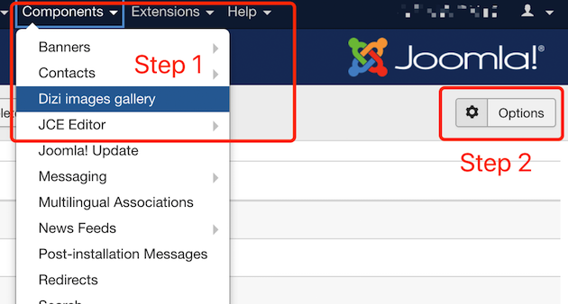
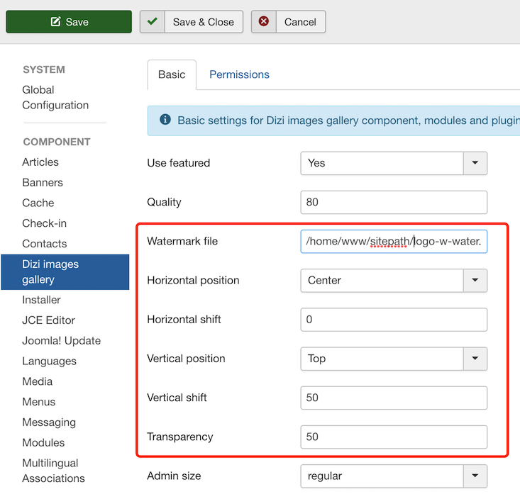
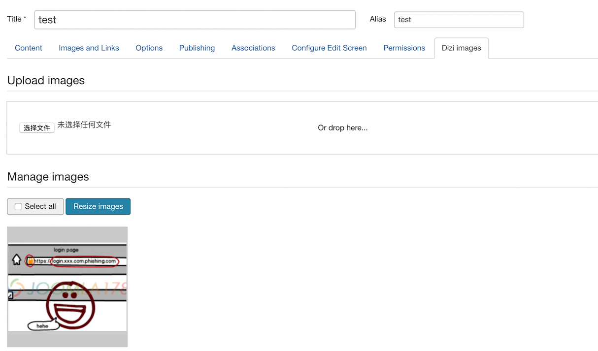
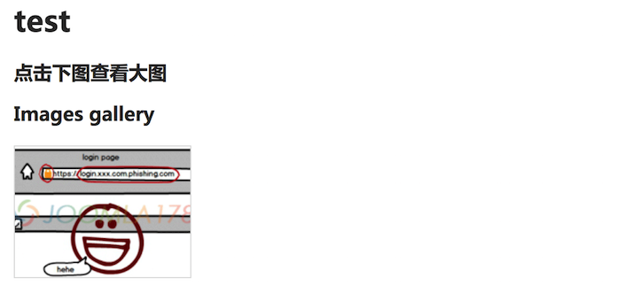
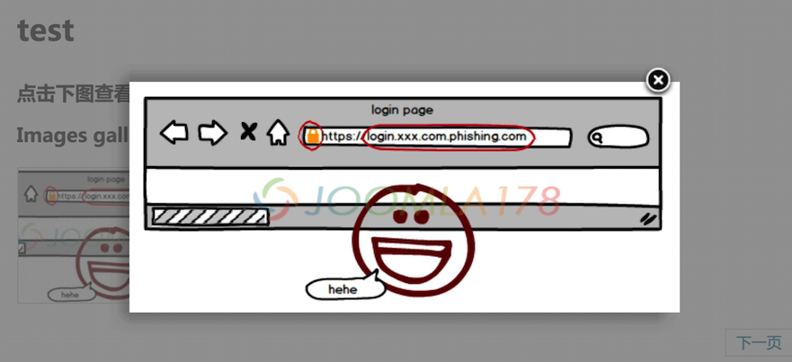

Dizi images gallery by joomla178
===

## Description

This is a upgrade version for Dizi images gallery. Since the original author no longer provide an updated version (https://extensions.joomla.org/extension/dizi-images-gallery/)

This extension does NOT implement the Joomla! Update System. I fixed the bug for Joomla 3.8.5+ based on the version 1.0.3 and added a picture watermarking feature.

## Usage

1. Download release version in this repository
2. Install package in Joomla! 3.8.5+
3. Config the global options of Dizi image gallery (Picture 1)
4. Fill in the value of each parameter (Picture 2)
5. Create a new article and upload a image in Dizi images opition (Picture 3)

## Screen shot

Picture 1

Picture 2

Picture 3

Picture 4

Picture 5

